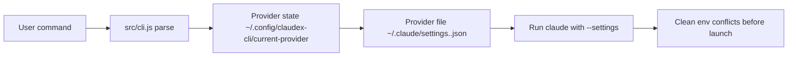

# claudex-cli

```
  ____ _        _   _   _ ____  _______  __
 / ___| |      / \ | | | |  _ \| ____\ \/ /
| |   | |     / _ \| | | | | | |  _|  \  /
| |___| |___ / ___ \ |_| | |_| | |___ /  \
 \____|_____/_/   \_\___/|____/|_____/_/\_\
```

Why does switching a Claude provider require editing 3 environment variables? `claudex use gpt` — done.

[](./README.md)
[](./README_cn.md)

[](./package.json)
[](./package.json)
[](./LICENSE)

**Best for**: people who want `claudex` to feel like native `claude`, while still being able to switch provider configs quickly and keep a persistent Native mode for third-party models.

**Not for**: users who only use a single static provider and never switch.

<!-- AI-CONTEXT
project: claudex-cli
one-liner: Switch Claude providers without touching env vars — one command
language: Node.js
min_runtime: node >= 18.0.0
package_manager: npm
install: npm i -g git+https://github.com/huaguihai/claudex-cli.git#main
verify: claudex --help
config_file: ~/.claude/settings.<name>.json; ~/.config/claudex-cli/current-provider
entry: bin/claudex.js
-->

## Agent Quick Start

```bash
# 1) Environment check
node -v
# require: >= 18

# 2) Install
npm i -g git+https://github.com/huaguihai/claudex-cli.git#main

# 3) Initialize shell helper and bootstrap global Claude settings
claudex init
# Note: if Claude Code is not installed, claudex will detect it
# and offer to install it automatically when you first run it.

# 4) Create a provider config (non-interactive)
mkdir -p ~/.claude
cat > ~/.claude/settings.gpt.json << 'EOF'
{
  "env": {
    "ANTHROPIC_BASE_URL": "https://api.example.com",
    "ANTHROPIC_API_KEY": "sk-your-key",
    "ANTHROPIC_DEFAULT_HAIKU_MODEL": "your-haiku-model",
    "ANTHROPIC_DEFAULT_SONNET_MODEL": "your-sonnet-model",
    "ANTHROPIC_DEFAULT_OPUS_MODEL": "your-opus-model"
  }
}
EOF

# Or use the interactive wizard:
# claudex add

# 5) Switch to that provider
claudex use gpt
# => 📌 Current provider: gpt

# 6) Verify connectivity
claudex test
# => ✅ Test OK: gpt (200)

# 7) Run Claude with current provider
claudex
# => launches claude --settings ~/.claude/settings.gpt.json

# On first run without any provider, claudex opens the guided menu.
# If ~/.claude/settings.json does not exist yet, claudex bootstraps it once
# with provider-agnostic Claude Code defaults.

# Optional: continue latest conversation
claudex --continue
```

## Core Capabilities

| Capability | What it does |
|---|---|
| `claudex` | Launches `claude --settings <provider>` — auto-detects and installs Claude Code if missing |
| `claudex use <name>` | Switches active provider in one command, persists across sessions |
| `claudex add` | Interactive wizard: name → base URL → API key → models |
| `claudex test [name]` | Provider connectivity test with protocol-aware probing and Claude smoke fallback |
| `claudex doctor` | Checks Claude Code install, env conflicts, Native state, and provider connectivity |
| `claudex native ...` | Persistent Native mode: enable/disable, inspect status, choose a profile, and access the same flow from `claudex menu` |
| `claudex menu` | Guided menu for users who prefer not to memorize commands |
| Native runtime context | Injects structured runtime context with provider profile, alignment policy, dynamic routing, session-aware guidance, and quality gates |
| Native benchmark harness | Compares `balanced` / `native-first` / `cost-first` across benchmark scenarios |
| Native replay | Replays multi-step session trajectories to verify research → plan → implement → verify transitions and verify reentry |
| Native smoke | Runs fast high-value checks for provider drift fallback, subagent conflict handling, and verify follow-up guidance |
| Native autotune | Generates profile recommendations from benchmark results |
| Native dashboard | Renders benchmark summary, recommendations, and provider comparison into HTML |

## Native Runtime System

Claudex Native mode is not just a toggle. It is the product layer that tries to make third-party models behave closer to native Claude Code workflows.

Current runtime layers:

- `src/native-context.js` — structured Native runtime context builder
- `src/provider-profile.js` — provider behavior profile inference
- `src/alignment-policy.js` — routing / delegation / response-style policy hints
- `src/provider-tuning.js` — provider-aware default profile selection and autotune integration
- `scripts/run-native-benchmark.js` — benchmark runner
- `scripts/summarize-native-benchmark.js` — markdown summary generator
- `scripts/generate-native-autotune.js` — autotune recommendation generator
- `scripts/render-native-dashboard.js` — HTML dashboard renderer
- `scripts/run-native-replay.js` — session replay runner for verify-closeout / verify-reentry paths
- `scripts/run-native-smoke.js` — smoke runner for drift fallback, conflict handling, and follow-up guidance

Profile intent:

- `native-first` — prioritize native Claude Code-like routing and workflow choices
- `balanced` — prefer Native behavior while staying conservative on compatibility-sensitive providers
- `cost-first` — reduce heavyweight workflow escalation and delegation

Provider-aware defaults:

- Anthropic-like / high-reliability providers tend toward `native-first`
- OpenAI-compatible providers default more conservatively toward `balanced`
- If autotune output exists, provider tuning prefers benchmark-driven recommendations over static defaults
- Current benchmark set can already distinguish anthropic/native-first from openai-compatible, proxy, and dashscope/balanced defaults without adding extra product surface

## How It Works



### Runtime flow

1. Parse command in [`src/cli.js`](./src/cli.js).
2. Resolve current provider from `~/.config/claudex-cli/current-provider`.
3. Load `~/.claude/settings.<name>.json`.
4. Strip `ANTHROPIC_AUTH_TOKEN`, `ANTHROPIC_API_KEY`, `ANTHROPIC_BASE_URL` from the process env.
5. Spawn `claude --settings <file> ...args`.

### Design decisions

- **Why strip env vars before launch?**
Without this, a shell-level `ANTHROPIC_API_KEY` silently overrides the provider file's key. You'd think you switched to provider B, but requests still hit provider A. This bug is invisible until you check your billing.

- **Why is `claudex` (no args) the default run command?**
Most users run Claude dozens of times a day. `claudex` is the same muscle memory as `claude`, just with automatic provider routing. Adding a subcommand (`claudex run`) would tax the most common path.

- **Why is `menu` a separate mode?**
Power users never want a menu between them and their shell. New users need guided setup. Separating the two means neither group pays the cost of the other.

## Installation

### Global install

```bash
npm i -g git+https://github.com/huaguihai/claudex-cli.git#main
```

### Local run from source

```bash
git clone https://github.com/huaguihai/claudex-cli.git
cd claudex-cli
node ./bin/claudex.js --help
```

If Claude Code is not installed, `claudex` shows the official recommended install command for your platform first. It does not rely on the deprecated npm-global Claude Code install path.

## Usage

### Switch provider and launch

```bash
claudex use gpt
# => 📌 Current provider: gpt

claudex
# => launches claude with gpt provider settings
```

### Enable Native mode

```bash
claudex native on
claudex native profile native-first
# persists across provider switches until you change it
```

Native mode now appends a structured runtime context instead of a single lightweight hint. The injected context can include:

- provider name and settings file
- protocol mode and effective slot mapping
- provider behavior profile
- alignment policy hints
- provider tuning / autotune recommendation

If you explicitly pass `--system-prompt` or `--append-system-prompt`, your explicit prompt still wins.

### Benchmark and autotune

Recommended main path:

```bash
npm run benchmark:native:all
```

This one command runs the main native regression chain in order:

1. `benchmark:native` — full benchmark matrix and report generation
2. `benchmark:native:summary` — readable markdown summary
3. `benchmark:native:autotune` — provider-aware profile recommendation
4. `benchmark:native:dashboard` — HTML visualization
5. `benchmark:native:smoke` — fast guardrail checks for key runtime behavior

Detailed commands:

```bash
npm run benchmark:native
npm run benchmark:native:summary
npm run benchmark:native:autotune
npm run benchmark:native:dashboard
npm run benchmark:native:smoke
npm run benchmark:native:replay
```

Outputs:

- `tests/native-benchmarks/last-report.json`
- `tests/native-benchmarks/last-summary.md`
- `tests/native-benchmarks/last-autotune.json`
- `tests/native-benchmarks/dashboard.html`
- `tests/native-benchmarks/last-smoke.json`
- `tests/native-benchmarks/last-replay.json`

How to use them:

- `benchmark:native:all` — preferred release / milestone validation path
- `benchmark:native:smoke` — quick guardrail check before or after runtime changes
- `benchmark:native:replay` — targeted session-trajectory diagnosis for verify-closeout and verify-reentry issues

Current benchmark/autotune behavior:

- anthropic / high-reliability surfaces currently converge toward `native-first`
- openai-compatible / proxy / dashscope surfaces currently converge toward `balanced`
- `native doctor` now shows de-duplicated policy hints so the effective routing/delegation strategy is easier to inspect
- current benchmark coverage already exercises the Session / Quality layer, especially session-aware guidance, subagent quality gate, task quality gate, verify closeout, and verify reentry

### Acceptance checklist

Use this as the current native sign-off baseline:

1. `npm run benchmark:native:all` completes successfully.
2. These artifacts are generated and up to date:
   - `tests/native-benchmarks/last-report.json`
   - `tests/native-benchmarks/last-summary.md`
   - `tests/native-benchmarks/last-autotune.json`
   - `tests/native-benchmarks/dashboard.html`
   - `tests/native-benchmarks/last-smoke.json`
3. `last-summary.md` includes `Real-task pass rate` and scenario recommendations.
4. `last-autotune.json` recommendations still match the current product story:
   - anthropic-like providers lean `native-first`
   - openai-compatible providers lean `balanced`
5. `last-smoke.json` passes all cases.
6. `benchmark:native:replay` remains available as a focused diagnostic for session progression, verify-closeout, and verify-reentry behavior.
7. Manual spot checks still cover real task classes such as:
   - repo research
   - bounded fix
   - multi-file plan-first work
   - provider-sensitive tasks
   - verify fail → fix → reverify → closeout
   - provider drift / subagent conflict scenarios

### Continue last conversation

```bash
claudex --continue
```

### Quick diagnostics

```bash
claudex doctor
# => 🩺 Doctor checks:
# => - Claude Code: installed (2.1.86)
# => - Env conflicts: none
# => - Native status: on (native-first)
# => - Provider test: OK (gpt, HTTP 200, openai-chat-completions)
```

## Commands

```text
claudex                          # launch claude with current provider
claudex --continue               # continue latest session
claudex menu                     # interactive menu
claudex init                     # initialize shell helper + state dir
claudex add                      # add provider (interactive)
claudex list                     # list all providers
claudex use <name|index>         # switch provider
claudex remove <name|index> [--yes]
claudex test [name|index]        # test API connectivity
claudex lang <zh|en>             # switch language
claudex status                   # show current config
claudex native on                # enable persistent Native mode
claudex native off               # disable persistent Native mode
claudex native status            # show Native status
claudex native profile [name]    # set or interactively choose a profile
claudex native doctor            # show Native checks
claudex update [--from-local <path>] [--from-npm]
claudex doctor [--provider <name>]
claudex run [claude args...]     # pass-through to claude
```

Update source: `claudex update` pulls from GitHub by default. Use `--from-npm` for the npm registry.

## Configuration Reference

### Global Claude Code file: `~/.claude/settings.json`

This file stores provider-agnostic defaults. `claudex` creates it only when the file does not already exist.

Example:

```json
{
  "env": {
    "CLAUDE_CODE_DISABLE_NONESSENTIAL_TRAFFIC": "1",
    "CLAUDE_CODE_ATTRIBUTION_HEADER": "0",
    "CLAUDE_CODE_DISABLE_EXPERIMENTAL_BETAS": "1",
    "ENABLE_TOOL_SEARCH": "false"
  }
}
```

### Provider file: `~/.claude/settings.<name>.json`

| Field | Required | Description |
|-------|----------|-------------|
| `ANTHROPIC_BASE_URL` | Yes | API endpoint (e.g. `https://api.anthropic.com`) |
| `ANTHROPIC_API_KEY` | Yes | Your API key |
| `ANTHROPIC_DEFAULT_HAIKU_MODEL` | Yes | Model name for Haiku-tier requests |
| `ANTHROPIC_DEFAULT_SONNET_MODEL` | Yes | Model name for Sonnet-tier requests |
| `ANTHROPIC_DEFAULT_OPUS_MODEL` | Yes | Model name for Opus-tier requests |

All fields live under the `env` key:

```json
{
  "env": {
    "ANTHROPIC_BASE_URL": "https://api.example.com",
    "ANTHROPIC_API_KEY": "sk-...",
    "ANTHROPIC_DEFAULT_HAIKU_MODEL": "gpt-5.4-mini",
    "ANTHROPIC_DEFAULT_SONNET_MODEL": "gpt-5.4",
    "ANTHROPIC_DEFAULT_OPUS_MODEL": "gpt-5.4-xhigh"
  }
}
```

### Current provider pointer

| Item | Value |
|------|-------|
| File | `~/.config/claudex-cli/current-provider` |
| Content | Provider name only (e.g. `gpt`) |

### Native mode state

| Item | Value |
|------|-------|
| File | `~/.config/claudex-cli/native.json` |
| Content | `{ "enabled": boolean, "profile": "native-first|balanced|cost-first" }` |

### Backups

Every time a provider file is overwritten, the previous version is saved to `~/.config/claudex-cli/backups/`.

## Troubleshooting (Top 3)

**`401 Invalid API key`**
→ Check provider file key value and base URL. Run `claudex test <name>`. Make sure shell-level Anthropic env vars aren't forcing another key.

**`Auth conflict: token and API key are both set`**
→ Remove one auth source from provider file. Avoid setting both shell vars globally.

**`Could not resolve host` / timeout**
→ Check DNS/proxy/network path. Verify endpoint with `curl`. Run `claudex doctor` for quick diagnostics.

## License

MIT

## Docs

- `docs/product-plan.md`
- `docs/native-roadmap.md`
- `tests/native-benchmarks/`
