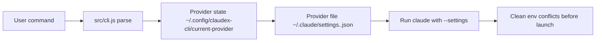

# claudex-cli

Switch and run Claude providers with one command.

[](./README.md)
[](./README_cn.md)

[](./package.json)
[](./LICENSE)

**Best for**: people who want `claudex` to feel like native `claude`, while still being able to switch provider configs quickly.

**Not for**: users who only use a single static provider and never switch.

<!-- AI-CONTEXT
project: claudex-cli
one-liner: Switch and run Claude providers with one command
language: Node.js
min_runtime: node >= 18.0.0
package_manager: npm
install: npm i -g claudex-cli
verify: claudex --help
config_file: ~/.claude/settings.<name>.json; ~/.config/claudex-cli/current-provider
entry: bin/claudex.js
-->

## Agent Quick Start

```bash
# 1) Environment check
node -v
# require: >= 18

# 2) Install
npm i -g claudex-cli

# 3) Initialize shell helper and local state
claudex init

# 4) Add a provider (interactive)
claudex add
# prompts:
# - provider name (e.g. gpt)
# - base URL
# - API key
# - haiku model
# - sonnet model
# - opus model

# 5) Switch to that provider
claudex use gpt

# 6) Verify connectivity
claudex test

# 7) Run Claude with current provider
claudex

# Optional: continue latest conversation
claudex --continue
```

## Core Capabilities

| Capability | What it does |
|---|---|
| `claudex` | Launches `claude --settings <current-provider-file>` |
| `claudex --continue` | Passes through to Claude continue flow |
| `claudex use <name>` | Switches active provider and persists it |
| `claudex add` | Creates `~/.claude/settings.<name>.json` interactively |
| `claudex test [name]` | Sends a live API probe (`/v1/messages`) |
| `claudex menu` | Opens guided menu for non-technical users |

## How It Works



### Runtime flow

1. Parse command in [`src/cli.js`](./src/cli.js).
2. Resolve current provider from `~/.config/claudex-cli/current-provider`.
3. Load `~/.claude/settings.<name>.json`.
4. Before launching Claude, remove `ANTHROPIC_AUTH_TOKEN`, `ANTHROPIC_API_KEY`, `ANTHROPIC_BASE_URL` from current shell env.
5. Spawn `claude --settings <file> ...args`.

### Design decisions

- Why keep `claudex` as default run command?
It matches native `claude` usage and keeps daily workflow short.

- Why keep `menu` as a separate mode?
New users get guided setup without forcing power users into menu flow.

- Why sanitize env vars before launch?
It prevents auth conflicts when shell-level variables override provider file settings.

## Installation

### Global install

```bash
npm i -g claudex-cli
```

### Local run from source

```bash
git clone https://github.com/huaguihai/claudex-cli.git
cd claudex-cli
node ./bin/claudex.js --help
```

## Commands

```text
claudex
claudex --continue
claudex menu
claudex init
claudex add
claudex list
claudex use <name|index>
claudex remove <name|index> [--yes]
claudex test [name|index]
claudex lang <zh|en>
claudex status
claudex update [--from-local <path>] [--from-npm]
claudex doctor [--provider <name>]
claudex run [claude args...]
```

## Configuration Reference

### Provider file: `~/.claude/settings.<name>.json`

Example:

```json
{
  "env": {
    "ANTHROPIC_BASE_URL": "https://api.example.com",
    "ANTHROPIC_API_KEY": "sk-...",
    "ANTHROPIC_DEFAULT_HAIKU_MODEL": "gpt-5.4",
    "ANTHROPIC_DEFAULT_SONNET_MODEL": "gpt-5.4",
    "ANTHROPIC_DEFAULT_OPUS_MODEL": "gpt-5.4"
  }
}
```

### Current provider pointer

- File: `~/.config/claudex-cli/current-provider`
- Value: provider name only (e.g. `gpt`)

## Troubleshooting (Top 3)

**1) `401 Invalid API key`**
- Check provider file key value and base URL.
- Run: `claudex test <name>`.
- Ensure shell-level Anthropic env vars are not forcing another key.

**2) `Auth conflict: token and API key are both set`**
- Remove one auth source from provider file.
- Avoid setting both shell vars globally.

**3) `Could not resolve host` / timeout**
- Check DNS/proxy/network path to provider endpoint.
- Verify endpoint manually with `curl`.
- Retry with `claudex doctor` for quick diagnostics.

## License

MIT
