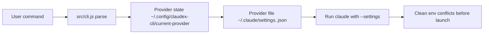

# claudex-cli

```
  ____ _        _   _   _ ____  _______  __
 / ___| |      / \ | | | |  _ \| ____\ \/ /
| |   | |     / _ \| | | | | | |  _|  \  /
| |___| |___ / ___ \ |_| | |_| | |___ /  \
 \____|_____/_/   \_\___/|____/|_____/_/\_\
```

Why does switching a Claude provider require editing 3 environment variables? `claudex use gpt` — done.

[](./README.md)
[](./README_cn.md)

[](./package.json)
[](./package.json)
[](./LICENSE)

**Best for**: people who want `claudex` to feel like native `claude`, while still being able to switch provider configs quickly.

**Not for**: users who only use a single static provider and never switch.

<!-- AI-CONTEXT
project: claudex-cli
one-liner: Switch Claude providers without touching env vars — one command
language: Node.js
min_runtime: node >= 18.0.0
package_manager: npm
install: npm i -g git+https://github.com/huaguihai/claudex-cli.git#main
verify: claudex --help
config_file: ~/.claude/settings.<name>.json; ~/.config/claudex-cli/current-provider
entry: bin/claudex.js
-->

## Agent Quick Start

```bash
# 1) Environment check
node -v
# require: >= 18

# 2) Install
npm i -g git+https://github.com/huaguihai/claudex-cli.git#main

# 3) Initialize shell helper and local state
claudex init
# Note: if Claude Code is not installed, claudex will detect it
# and offer to install it automatically when you first run it.

# 4) Create a provider config (non-interactive)
mkdir -p ~/.claude
cat > ~/.claude/settings.gpt.json << 'EOF'
{
  "env": {
    "ANTHROPIC_BASE_URL": "https://api.example.com",
    "ANTHROPIC_API_KEY": "sk-your-key",
    "ANTHROPIC_DEFAULT_HAIKU_MODEL": "your-haiku-model",
    "ANTHROPIC_DEFAULT_SONNET_MODEL": "your-sonnet-model",
    "ANTHROPIC_DEFAULT_OPUS_MODEL": "your-opus-model"
  }
}
EOF

# Or use the interactive wizard:
# claudex add

# 5) Switch to that provider
claudex use gpt
# => 📌 Current provider: gpt

# 6) Verify connectivity
claudex test
# => ✅ Test OK: gpt (200)

# 7) Run Claude with current provider
claudex
# => launches claude --settings ~/.claude/settings.gpt.json

# Optional: continue latest conversation
claudex --continue
```

## Core Capabilities

| Capability | What it does |
|---|---|
| `claudex` | Launches `claude --settings <provider>` — auto-detects and installs Claude Code if missing |
| `claudex use <name>` | Switches active provider in one command, persists across sessions |
| `claudex add` | Interactive wizard: name → base URL → API key → models |
| `claudex test [name]` | Live API probe to `/v1/messages` — confirms key + endpoint are working |
| `claudex doctor` | Checks Claude Code install, env conflicts, and API connectivity |
| `claudex menu` | Guided menu for users who prefer not to memorize commands |
| `claudex --continue` | Passes through to Claude's continue-session flow |

## How It Works



### Runtime flow

1. Parse command in [`src/cli.js`](./src/cli.js).
2. Resolve current provider from `~/.config/claudex-cli/current-provider`.
3. Load `~/.claude/settings.<name>.json`.
4. Strip `ANTHROPIC_AUTH_TOKEN`, `ANTHROPIC_API_KEY`, `ANTHROPIC_BASE_URL` from the process env.
5. Spawn `claude --settings <file> ...args`.

### Design decisions

- **Why strip env vars before launch?**
Without this, a shell-level `ANTHROPIC_API_KEY` silently overrides the provider file's key. You'd think you switched to provider B, but requests still hit provider A. This bug is invisible until you check your billing.

- **Why is `claudex` (no args) the default run command?**
Most users run Claude dozens of times a day. `claudex` is the same muscle memory as `claude`, just with automatic provider routing. Adding a subcommand (`claudex run`) would tax the most common path.

- **Why is `menu` a separate mode?**
Power users never want a menu between them and their shell. New users need guided setup. Separating the two means neither group pays the cost of the other.

## Installation

### Global install

```bash
npm i -g git+https://github.com/huaguihai/claudex-cli.git#main
```

### Local run from source

```bash
git clone https://github.com/huaguihai/claudex-cli.git
cd claudex-cli
node ./bin/claudex.js --help
```

## Usage

### Switch provider and launch

```bash
claudex use gpt
# => 📌 Current provider: gpt

claudex
# => launches claude with gpt provider settings
```

### Continue last conversation

```bash
claudex --continue
```

### Quick diagnostics

```bash
claudex doctor
# => 🩺 Doctor checks:
# => - Claude Code: installed (2.1.86)
# => - Env conflicts: none
# => - Provider test: OK (gpt, HTTP 200)
```

## Commands

```text
claudex                          # launch claude with current provider
claudex --continue               # continue latest session
claudex menu                     # interactive menu
claudex init                     # initialize shell helper + state dir
claudex add                      # add provider (interactive)
claudex list                     # list all providers
claudex use <name|index>         # switch provider
claudex remove <name|index> [--yes]
claudex test [name|index]        # test API connectivity
claudex lang <zh|en>             # switch language
claudex status                   # show current config
claudex update [--from-local <path>] [--from-npm]
claudex doctor [--provider <name>]
claudex run [claude args...]     # pass-through to claude
```

Update source: `claudex update` pulls from GitHub by default. Use `--from-npm` for the npm registry.

## Configuration Reference

### Provider file: `~/.claude/settings.<name>.json`

| Field | Required | Description |
|-------|----------|-------------|
| `ANTHROPIC_BASE_URL` | Yes | API endpoint (e.g. `https://api.anthropic.com`) |
| `ANTHROPIC_API_KEY` | Yes | Your API key |
| `ANTHROPIC_DEFAULT_HAIKU_MODEL` | Yes | Model name for Haiku-tier requests |
| `ANTHROPIC_DEFAULT_SONNET_MODEL` | Yes | Model name for Sonnet-tier requests |
| `ANTHROPIC_DEFAULT_OPUS_MODEL` | Yes | Model name for Opus-tier requests |

All fields live under the `env` key:

```json
{
  "env": {
    "ANTHROPIC_BASE_URL": "https://api.example.com",
    "ANTHROPIC_API_KEY": "sk-...",
    "ANTHROPIC_DEFAULT_HAIKU_MODEL": "gpt-5.4-mini",
    "ANTHROPIC_DEFAULT_SONNET_MODEL": "gpt-5.4",
    "ANTHROPIC_DEFAULT_OPUS_MODEL": "gpt-5.4-xhigh"
  }
}
```

### Current provider pointer

| Item | Value |
|------|-------|
| File | `~/.config/claudex-cli/current-provider` |
| Content | Provider name only (e.g. `gpt`) |

### Backups

Every time a provider file is overwritten, the previous version is saved to `~/.config/claudex-cli/backups/`.

## Troubleshooting (Top 3)

**`401 Invalid API key`**
→ Check provider file key value and base URL. Run `claudex test <name>`. Make sure shell-level Anthropic env vars aren't forcing another key.

**`Auth conflict: token and API key are both set`**
→ Remove one auth source from provider file. Avoid setting both shell vars globally.

**`Could not resolve host` / timeout**
→ Check DNS/proxy/network path. Verify endpoint with `curl`. Run `claudex doctor` for quick diagnostics.

## License

MIT
