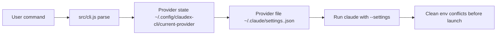

# claudex-cli

```
  ____ _        _   _   _ ____  _______  __
 / ___| |      / \ | | | |  _ \| ____\ \/ /
| |   | |     / _ \| | | | | | |  _|  \  /
| |___| |___ / ___ \ |_| | |_| | |___ /  \
 \____|_____/_/   \_\___/|____/|_____/_/\_\
```

Switch AI coding CLI providers without touching env vars or TOML files — one command.

- `claudex use <name>` — switches **Claude Code** provider (available today)
- `codexx use <name>` — switches **OpenAI Codex** provider (in development, see [spec](./docs/codexx-spec.md))

[](./README.md)
[](./README_cn.md)

[](./package.json)
[](./package.json)
[](./LICENSE)

**Best for**: people who want `claudex` / `codexx` to feel like native `claude` / `codex`, while still being able to switch provider configs quickly and keep a persistent Native mode for third-party models.

**Not for**: users who only use a single static provider and never switch.

<!-- AI-CONTEXT
project: claudex-cli
one-liner: Switch Claude Code and OpenAI Codex providers without touching env vars or TOML — one command
language: Node.js
min_runtime: node >= 18.0.0
package_manager: npm
install: npm i -g git+https://github.com/huaguihai/claudex-cli.git#main
verify: claudex --help
config_file: ~/.claude/settings.<name>.json; ~/.config/claudex-cli/current-provider; ~/.codex/config.toml (codexx, planned)
entry: bin/claudex.js (claudex); bin/codexx.js (codexx, planned)
binaries: claudex (Claude Code), codexx (OpenAI Codex, planned — see docs/codexx-spec.md)
-->

## Agent Quick Start

```bash
# 1) Environment check
node -v
# require: >= 18

# 2) Install
npm i -g git+https://github.com/huaguihai/claudex-cli.git#main

# 3) Initialize shell helpers and bootstrap global Claude settings
claudex init
# Installs `cdxrun` + a `claude` wrapper, so running `claude` directly
# auto-uses your current provider (yields to an explicit --settings,
# pre-set ANTHROPIC_* vars, or a missing provider — falls back to plain claude).
# Note: if Claude Code is not installed, claudex will detect it
# and offer to install it automatically when you first run it.

# 4) Create a provider config (non-interactive)
mkdir -p ~/.claude
cat > ~/.claude/settings.gpt.json << 'EOF'
{
  "env": {
    "ANTHROPIC_BASE_URL": "https://api.example.com",
    "ANTHROPIC_API_KEY": "sk-your-key",
    "ANTHROPIC_DEFAULT_HAIKU_MODEL": "your-haiku-model",
    "ANTHROPIC_DEFAULT_SONNET_MODEL": "your-sonnet-model",
    "ANTHROPIC_DEFAULT_OPUS_MODEL": "your-opus-model"
  }
}
EOF

# Or use the interactive wizard:
# claudex add

# 5) Switch to that provider
claudex use gpt
# => 📌 Current provider: gpt

# 6) Verify connectivity
claudex test
# => ✅ Test OK: gpt (200)

# 7) Run Claude with current provider
claudex
# => launches claude --settings ~/.claude/settings.gpt.json

# On first run without any provider, claudex opens the guided menu.
# If ~/.claude/settings.json does not exist yet, claudex bootstraps it once
# with provider-agnostic Claude Code defaults.

# Optional: continue latest conversation
claudex --continue
```

## Core Capabilities

| Capability | What it does |
|---|---|
| `claudex` | Launches `claude --settings <provider>` — auto-detects and installs Claude Code if missing |
| `claudex use <name>` | Switches active provider in one command, persists across sessions |
| `claudex add` | Interactive wizard: name → base URL → API key → models |
| `claudex test [name]` | Provider connectivity test with protocol-aware probing and Claude smoke fallback |
| `claudex doctor` | Checks Claude Code install, env conflicts, Native state, and provider connectivity |
| `claudex native ...` | Persistent Native mode: enable/disable, inspect status, choose a mode, and access the same flow from `claudex menu` |
| `claudex menu` | Guided menu for users who prefer not to memorize commands |
| Native runtime context | Injects structured runtime context with provider profile, alignment policy, dynamic routing, session-aware guidance, and quality gates |
| Native benchmark harness | Compares `stable` / `native` / `aggressive` across benchmark scenarios |
| Native replay | Replays multi-step session trajectories to verify research → plan → implement → verify transitions and verify reentry |
| Native smoke | Runs fast high-value checks for provider drift fallback, subagent conflict handling, and verify follow-up guidance |
| Native autotune | Generates mode recommendations from benchmark results |
| Native dashboard | Renders benchmark summary, recommendations, and provider comparison into HTML |

## Native Runtime System

Claudex Native mode is not just a toggle. It is the product layer that tries to make third-party models behave closer to native Claude Code workflows.

Current runtime layers:

- `src/native-context.js` — structured Native runtime context builder
- `src/provider-profile.js` — provider behavior profile inference
- `src/alignment-policy.js` — routing / delegation / response-style policy hints
- `src/provider-tuning.js` — provider-aware default mode selection and autotune integration
- `scripts/run-native-benchmark.js` — benchmark runner
- `scripts/summarize-native-benchmark.js` — markdown summary generator
- `scripts/generate-native-autotune.js` — autotune recommendation generator
- `scripts/render-native-dashboard.js` — HTML dashboard renderer
- `scripts/run-native-replay.js` — session replay runner for verify-closeout / verify-reentry paths
- `scripts/run-native-smoke.js` — smoke runner for drift fallback, conflict handling, and follow-up guidance

Mode intent:

- `stable` — prioritize reliability, conservative delegation, and predictable guardrails
- `native` — default; prioritize Claude Code-like workflow continuation and output feel
- `aggressive` — prioritize peak native-like experience and stronger workflow reuse, accepting more variance

These modes are not cost tiers. They are experience promises:
- stable = predictability first
- native = default native-feel mode
- aggressive = peak experience mode for users willing to trade some stability

Provider-aware defaults:

- Anthropic-like / high-reliability providers tend toward `native`
- OpenAI-compatible providers default more conservatively toward `stable`
- If autotune output exists, provider tuning prefers benchmark-driven recommendations over static defaults
- Current benchmark set can already distinguish anthropic/native from openai-compatible, proxy, and dashscope/stable defaults without adding extra product surface

## How It Works


```mermaid
graph LR
    A[User command] --> B[src/cli.js parse]
    B --> C[Provider state ~/.config/claudex-cli/current-provider]
    C --> D[Provider file ~/.claude/settings.<name>.json]
    D --> E[Run claude with --settings]
    E --> F[Clean env conflicts before launch]
```

### Runtime flow

1. Parse command in [`src/cli.js`](./src/cli.js).
2. Resolve current provider from `~/.config/claudex-cli/current-provider`.
3. Load `~/.claude/settings.<name>.json`.
4. Strip `ANTHROPIC_AUTH_TOKEN`, `ANTHROPIC_API_KEY`, `ANTHROPIC_BASE_URL` from the process env.
5. Spawn `claude --settings <file> ...args`.

### Design decisions

- **Why strip env vars before launch?**
Without this, a shell-level `ANTHROPIC_API_KEY` silently overrides the provider file's key. You'd think you switched to provider B, but requests still hit provider A. This bug is invisible until you check your billing.

- **Why is `claudex` (no args) the default run command?**
Most users run Claude dozens of times a day. `claudex` is the same muscle memory as `claude`, just with automatic provider routing. Adding a subcommand (`claudex run`) would tax the most common path.

- **Why is `menu` a separate mode?**
Power users never want a menu between them and their shell. New users need guided setup. Separating the two means neither group pays the cost of the other.

## Installation

### Global install

```bash
npm i -g git+https://github.com/huaguihai/claudex-cli.git#main
```

### Local run from source

```bash
git clone https://github.com/huaguihai/claudex-cli.git
cd claudex-cli
node ./bin/claudex.js --help
```

If Claude Code is not installed, `claudex` shows the official recommended install command for your platform first. It does not rely on the deprecated npm-global Claude Code install path.

## Usage

### Switch provider and launch

```bash
claudex use gpt
# => 📌 Current provider: gpt

claudex
# => launches claude with gpt provider settings
```

### Enable Native mode

```bash
claudex native on
claudex native profile native
# persists across provider switches until you change it
```

Native mode now appends a structured runtime context instead of a single lightweight hint. The injected context can include:

- provider name and settings file
- protocol mode and effective slot mapping
- provider behavior profile
- alignment policy hints
- provider tuning / autotune recommendation

If you explicitly pass `--system-prompt` or `--append-system-prompt`, your explicit prompt still wins.

### Benchmark and autotune

Recommended main path:

```bash
npm run benchmark:native:all
```

This one command runs the main native regression chain in order:

1. `benchmark:native` — full benchmark matrix and report generation
2. `benchmark:native:summary` — readable markdown summary
3. `benchmark:native:autotune` — provider-aware mode recommendation
4. `benchmark:native:dashboard` — HTML visualization
5. `benchmark:native:smoke` — fast guardrail checks for key runtime behavior

Detailed commands:

```bash
npm run benchmark:native
npm run benchmark:native:summary
npm run benchmark:native:autotune
npm run benchmark:native:dashboard
npm run benchmark:native:smoke
npm run benchmark:native:replay
```

Outputs:

- `tests/native-benchmarks/last-report.json`
- `tests/native-benchmarks/last-summary.md`
- `tests/native-benchmarks/last-autotune.json`
- `tests/native-benchmarks/dashboard.html`
- `tests/native-benchmarks/last-smoke.json`
- `tests/native-benchmarks/last-replay.json`

How to use them:

- `benchmark:native:all` — preferred release / milestone validation path
- `benchmark:native:smoke` — quick guardrail check before or after runtime changes
- `benchmark:native:replay` — targeted session-trajectory diagnosis for verify-closeout and verify-reentry issues

Current benchmark/autotune behavior:

- anthropic / high-reliability surfaces currently converge toward `native`
- openai-compatible / proxy / dashscope surfaces currently converge toward `stable`
- `native doctor` now shows de-duplicated policy hints so the effective routing/delegation strategy is easier to inspect
- current benchmark coverage already exercises the Session / Quality layer, especially session-aware guidance, subagent quality gate, task quality gate, verify closeout, and verify reentry

### Acceptance checklist

Use this as the current native sign-off baseline:

1. `npm run benchmark:native:all` completes successfully.
2. These artifacts are generated and up to date:
   - `tests/native-benchmarks/last-report.json`
   - `tests/native-benchmarks/last-summary.md`
   - `tests/native-benchmarks/last-autotune.json`
   - `tests/native-benchmarks/dashboard.html`
   - `tests/native-benchmarks/last-smoke.json`
3. `last-summary.md` includes `Real-task pass rate` and scenario recommendations.
4. `last-autotune.json` recommendations still match the current product story:
   - anthropic-like providers lean `native`
   - openai-compatible providers lean `stable`
5. `last-smoke.json` passes all cases.
6. `benchmark:native:replay` remains available as a focused diagnostic for session progression, verify-closeout, and verify-reentry behavior.
7. Manual spot checks still cover real task classes such as:
   - repo research
   - bounded fix
   - multi-file plan-first work
   - provider-sensitive tasks
   - verify fail → fix → reverify → closeout
   - provider drift / subagent conflict scenarios

### Continue last conversation

```bash
claudex --continue
```

### Quick diagnostics

```bash
claudex doctor
# => 🩺 Doctor checks:
# => - Claude Code: installed (2.1.86)
# => - Env conflicts: none
# => - Native status: on (native)
# => - Provider test: OK (gpt, HTTP 200, openai-chat-completions)
```

## Commands

```text
claudex                          # launch claude with current provider
claudex --continue               # continue latest session
claudex menu                     # interactive menu
claudex init                     # install shell helpers (cdxrun + claude wrapper) + state dir
claudex add                      # add provider (interactive)
claudex list                     # list all providers
claudex use <name|index>         # switch provider
claudex remove <name|index> [--yes]
claudex test [name|index]        # test API connectivity
claudex lang <zh|en>             # switch language
claudex status                   # show current config
claudex native on                # enable persistent Native mode
claudex native off               # disable persistent Native mode
claudex native status            # show Native status
claudex native profile [name]    # set or interactively choose a mode
claudex native doctor            # show Native checks
claudex update [--from-local <path>] [--from-npm]
claudex doctor [--provider <name>]
claudex run [claude args...]     # pass-through to claude
```

Update source: `claudex update` pulls from GitHub by default. Use `--from-npm` for the npm registry. After a successful update it also refreshes your shell helpers automatically (runs `claudex init` for you).

## Configuration Reference

### Global Claude Code file: `~/.claude/settings.json`

This file stores provider-agnostic defaults. `claudex` creates it only when the file does not already exist.

Example:

```json
{
  "env": {
    "CLAUDE_CODE_DISABLE_NONESSENTIAL_TRAFFIC": "1",
    "CLAUDE_CODE_ATTRIBUTION_HEADER": "0",
    "CLAUDE_CODE_DISABLE_EXPERIMENTAL_BETAS": "1",
    "ENABLE_TOOL_SEARCH": "false"
  }
}
```

### Provider file: `~/.claude/settings.<name>.json`

| Field | Required | Description |
|-------|----------|-------------|
| `ANTHROPIC_BASE_URL` | Yes | API endpoint (e.g. `https://api.anthropic.com`) |
| `ANTHROPIC_API_KEY` | Yes | Your API key |
| `ANTHROPIC_DEFAULT_HAIKU_MODEL` | Yes | Model name for Haiku-tier requests |
| `ANTHROPIC_DEFAULT_SONNET_MODEL` | Yes | Model name for Sonnet-tier requests |
| `ANTHROPIC_DEFAULT_OPUS_MODEL` | Yes | Model name for Opus-tier requests |

All fields live under the `env` key:

```json
{
  "env": {
    "ANTHROPIC_BASE_URL": "https://api.example.com",
    "ANTHROPIC_API_KEY": "sk-...",
    "ANTHROPIC_DEFAULT_HAIKU_MODEL": "gpt-5.4-mini",
    "ANTHROPIC_DEFAULT_SONNET_MODEL": "gpt-5.4",
    "ANTHROPIC_DEFAULT_OPUS_MODEL": "gpt-5.4-xhigh"
  }
}
```

### Current provider pointer

| Item | Value |
|------|-------|
| File | `~/.config/claudex-cli/current-provider` |
| Content | Provider name only (e.g. `gpt`) |

### Native mode state

| Item | Value |
|------|-------|
| File | `~/.config/claudex-cli/native.json` |
| Content | `{ "enabled": boolean, "profile": "stable|native|aggressive" }` |

### Backups

Every time a provider file is overwritten, the previous version is saved to `~/.config/claudex-cli/backups/`.

## Troubleshooting (Top 5)

**`401 Invalid API key`**
→ Check provider file key value and base URL. Run `claudex test <name>`. Make sure shell-level Anthropic env vars aren't forcing another key.

**`Auth conflict: token and API key are both set`**
→ Remove one auth source from provider file. Avoid setting both shell vars globally.

**`Could not resolve host` / timeout**
→ Check DNS/proxy/network path. Verify endpoint with `curl`. Run `claudex doctor` for quick diagnostics.

**`claude` says `Not logged in` when run directly**
→ Run `claudex init` once, then `source ~/.bashrc` (or open a new terminal). The injected `claude` wrapper makes a bare `claude` use your current provider. (A shell-level `ANTHROPIC_API_KEY` still takes precedence by design.)

**Windows: `claudex` launches an older `claude` than typing `claude` yourself**
→ Node resolves a bare `claude` to `claude.exe` only, so it skips npm's `claude.cmd`/`claude.ps1` shims and can hit an older WinGet-installed `claude.exe`. `claudex` now mirrors your shell's `PATH`/`PATHEXT` lookup and launches the same `claude` you get interactively (running the npm install's `cli.js` with your `node`). Keep your npm global bin (e.g. `%APPDATA%\npm`) ahead of the WinGet path in `PATH`.

---

## codexx — OpenAI Codex provider switching

`codexx` is the symmetric counterpart to `claudex`: same command surface, same muscle memory, but it targets **OpenAI Codex** (CLI + Desktop App + VS Code extension all read the same `~/.codex/` files, so one switch covers them all).

For the full implementation contract see [`docs/codexx-spec.md`](./docs/codexx-spec.md).

### Quick Start

```bash
# 1) Same install as claudex
npm i -g git+https://github.com/huaguihai/claudex-cli.git#main

# 2) Initialise state dir + check codex install
codexx init

# 3) Add a Codex provider (interactive)
codexx add
# > Name: openrouter
# > Base URL: https://openrouter.ai/api/v1
# > API Key: sk-or-v1-...
# > Model: anthropic/claude-sonnet-4.5
# > Wire API (chat/responses) [chat]: chat

# Or non-interactive:
codexx add --name openrouter \
  --base-url https://openrouter.ai/api/v1 \
  --api-key sk-or-v1-... \
  --model anthropic/claude-sonnet-4.5 \
  --wire-api chat

# 4) Switch to it
codexx use openrouter
# ✅ Switched to provider: openrouter
#    Endpoint: https://openrouter.ai/api/v1
#    Model: anthropic/claude-sonnet-4.5
#    Backup: ~/.config/claudex-cli/codex-backups/2026-05-17T.../

# 5) Run codex as usual
codexx
# (passthrough; Codex Desktop App + IDE extension also use this provider now)

# 6) Diagnose
codexx doctor

# 7) When done: revert to pre-codexx state
codexx revert
```

### Core Capabilities

| Capability | What it does |
|---|---|
| `codexx` | Spawns `codex` with the active provider; passes through all native subcommands |
| `codexx use <name>` | Switches active provider; persists in `~/.codex/config.toml` + `~/.codex/auth.json` |
| `codexx add / list / edit / remove` | Provider CRUD with validation; `edit` patches fields in place (Enter-to-keep wizard, or `--model X` flag for single-field changes) |
| `codexx test [name]` | HTTP probe respecting `wire_api` (chat / responses) |
| `codexx status` | Active provider + Codex version + Desktop App state + drift |
| `codexx doctor [--json]` | 13-check health report (CLI version, drift, env conflicts, project-local config, credentials store, native context integrity, …) |
| `codexx native on/off/profile` | Inject runtime context block into `~/.codex/AGENTS.md` with delimiters; fully removable |
| `codexx menu` | Interactive menu — same UX shape as `claudex menu` |
| `codexx snapshot / restore / revert` | First-run snapshot + per-switch backups + atomic restore |
| `codexx reconcile` | After `codex login` / `codex mcp add` / external edits, accept current state as new baseline |
| `codexx restore-chatgpt` | Restore ChatGPT OAuth tokens from backup if codexx overwrote them |
| `codexx login / logout / app` | Claudex-aware wrappers — warn before clobbering managed state, then passthrough |
| `codexx -- <args>` | Force pure passthrough (escape hatch for any future codex subcommand) |

### How It Works


```mermaid
graph LR
    A[codexx use openrouter] --> B[ensurePreClaudexSnapshot]
    B --> C[Read before-state + hashes]
    C --> D[Drift check vs last-known]
    D --> E[Build target: TOML surgery + auth payload]
    E --> F[Backup config.toml + auth.json]
    F --> G[Write auth.json atomically]
    G --> H[Write config.toml atomically]
    H --> I[Post-verify non-claudex untouched]
    I --> J[Update last-known hashes + audit log]
```

Key design choices:

- **String-level surgical TOML edit, not round-trip.** No Node TOML library preserves comments/format on re-serialise. `codexx` finds its own marker-delimited sections and rewrites only those, leaving every other byte (your comments, MCP servers, project trusts, plugins, marketplaces) bit-identical.
- **`requires_openai_auth = true` + `env_key = "OPENAI_API_KEY"`** in every managed section, so Codex's AuthManager picks up the API key from `auth.json` regardless of how the binary is launched (CLI from terminal, Desktop App from Dock, VS Code extension).
- **Double-file atomic write with rollback.** Writes `auth.json` first; if `config.toml` write fails, the auth write is rolled back.
- **First-use snapshot + per-switch backups.** `codexx revert` always knows how to restore the pre-codexx state byte-for-byte.

### Commands

```text
codexx                              # spawn codex with current provider
codexx [<codex args>...]            # passthrough (e.g. codexx resume --last)
codexx -- <args>                    # force passthrough
codexx init                         # state dir + check codex install
codexx menu                         # interactive menu
codexx add [flags]                  # add provider (wizard or flags)
codexx edit <name|index> [flags]    # patch fields in place (wizard or flags)
codexx list                         # list providers
codexx use <name|index>             # switch active provider
codexx remove <name|index> [--yes]
codexx test [name|index]            # connectivity probe
codexx status                       # active provider + Codex/App state
codexx doctor [--json] [--provider <name>]
codexx snapshot                     # ensure pre-codexx snapshot
codexx restore <id|latest>          # restore a previous backup
codexx revert [--yes]               # restore pre-codexx state
codexx audit [--tail N]             # view audit log (JSONL)
codexx reconcile [--yes]            # accept external edits as new baseline
codexx restore-chatgpt [--yes]      # restore ChatGPT OAuth tokens from backup
codexx native on|off|status|profile [name]|doctor
codexx lang <zh|en>                 # CLI language
codexx update                       # self-update
codexx login / logout / app         # claudex-aware codex wrappers
```

### Configuration Reference

| File | Owner | Purpose |
|---|---|---|
| `~/.codex/config.toml` | shared with codex | codexx writes only `[model_providers.claudex-<name>]` sections + top-level `model` / `model_provider`, marker-delimited |
| `~/.codex/auth.json` | shared with codex | codexx writes the active provider's API key (apikey mode); ChatGPT OAuth tokens are backed up before being overwritten |
| `~/.codex/AGENTS.md` | shared with codex (user) | only touched when Native is on, inside delimited section |
| `~/.config/claudex-cli/codex-providers/<name>.json` | codexx | provider metadata (api_key, base_url, model, …); chmod 600 |
| `~/.config/claudex-cli/codex-current-provider` | codexx | single line = active provider name |
| `~/.config/claudex-cli/codex-snapshot/pre-claudex/` | codexx | byte-identical copy of `~/.codex/` from first `codexx use` |
| `~/.config/claudex-cli/codex-backups/<ts>/` | codexx | per-switch backups (config.toml + auth.json + reason + hashes) |
| `~/.config/claudex-cli/codex-audit.log` | codexx | JSONL audit trail (use / revert / drift / chatgpt-backup events) |
| `~/.config/claudex-cli/codex-last-known-hashes.json` | codexx | drift detection baseline |
| `~/.config/claudex-cli/codex-native.json` | codexx | `{ enabled, profile, last_injected_hash }` |

Provider metadata schema:

```json
{
  "schema_version": 1,
  "name": "openrouter",
  "base_url": "https://openrouter.ai/api/v1",
  "api_key": "sk-or-v1-...",
  "model": "anthropic/claude-sonnet-4.5",
  "wire_api": "chat",
  "model_reasoning_effort": "medium",
  "http_headers": { "X-Title": "claudex" }
}
```

### Compatibility

| Component | Status |
|---|---|
| codex CLI | works on all versions; **upgrade to v0.130+** for config hot-reload (otherwise restart codex after switching) |
| Codex Desktop App | reads `config.toml` + `auth.json` like the CLI; UI model picker may show "Custom" for non-OpenAI providers (upstream cosmetic issue [#19694](https://github.com/openai/codex/issues/19694), routing works correctly) |
| Codex VS Code extension | reads the same files; some new-conversation model defaults are upstream bugs ([#4558](https://github.com/openai/codex/issues/4558)) |
| ChatGPT subscription | coexists — `codexx` backs up your OAuth tokens before overwriting; `codexx restore-chatgpt` brings them back |
| macOS | first-class |
| Linux / Windows | best-effort in MVP; keyring backend planned for v2 |
| `cli_auth_credentials_store = "keyring"` | not yet supported — `codexx doctor` will warn |

### Troubleshooting

**`codexx use` says drift detected**
→ Something (likely `codex login`, `codex mcp add`, or a manual edit) changed `~/.codex/config.toml` or `auth.json` since the last switch. Run `codexx doctor` to see specifics; `codexx reconcile` to accept the external state as the new baseline, or `--force` on `use` to overwrite.

**Desktop App still using the old provider after `codexx use`**
→ Codex < v0.130 doesn't hot-reload config. Restart the Desktop App (Cmd+Q then re-launch). On v0.130+, the App picks up changes automatically.

**`codexx test` returns 401**
→ Either the API key is wrong, or your shell has `OPENAI_API_KEY` set to a different value (terminal codex would use the shell env over `auth.json`). `codexx doctor` flags this as `shell_env_conflict`.

**Lost ChatGPT subscription after using codexx**
→ Your OAuth tokens are backed up to `~/.config/claudex-cli/codex-backups/<latest>/chatgpt-tokens.json`. Run `codexx restore-chatgpt` to put them back; then run `codex login` if you want to re-establish the session.

### Before Uninstalling

`npm uninstall -g claudex-cli` does **not** auto-clean `~/.codex/`. To return to a fully native Codex state:

```bash
codexx revert            # restores config.toml + auth.json to pre-codexx state
npm uninstall -g claudex-cli
```

If you forget the revert, the leftover `[model_providers.claudex-*]` sections and the `_claudex_managed` keys in `auth.json` are harmless to native codex but you may want to clean them by hand.

## License

MIT

## Docs

- [`docs/codexx-spec.md`](./docs/codexx-spec.md) — codexx implementation contract
- [`docs/product-plan.md`](./docs/product-plan.md) — claudex product direction
- [`docs/native-roadmap.md`](./docs/native-roadmap.md) — Native subsystem roadmap
- [`tests/native-benchmarks/`](./tests/native-benchmarks/) — benchmark artifacts
