# claudex-cli

```
  ____ _        _   _   _ ____  _______  __
 / ___| |      / \ | | | |  _ \| ____\ \/ /
| |   | |     / _ \| | | | | | |  _|  \  /
| |___| |___ / ___ \ |_| | |_| | |___ /  \
 \____|_____/_/   \_\___/|____/|_____/_/\_\
```

一条命令切换 AI 编码 CLI 的服务商，不用碰环境变量也不用手改 TOML。

- `claudex use <name>` —— 切换 **Claude Code** 服务商（已发布）
- `codexx use <name>` —— 切换 **OpenAI Codex** 服务商（开发中，详见 [spec](./docs/codexx-spec.md)）

[](./README.md)
[](./README_cn.md)

[](./package.json)
[](./package.json)
[](./LICENSE)

**适合**：希望保留原生 `claude` / `codex` 使用手感，同时需要快速切换不同服务商配置，并为第三方模型长期保持 Native 模式的用户。

**不适合**：只用单一固定服务商、几乎不需要切换的场景。

<!-- AI-CONTEXT
project: claudex-cli
one-liner: 一条命令切换 Claude Code 与 OpenAI Codex 的服务商，不用碰环境变量也不用手改 TOML
language: Node.js
min_runtime: node >= 18.0.0
package_manager: npm
install: npm i -g git+https://github.com/huaguihai/claudex-cli.git#main
verify: claudex --help
config_file: ~/.claude/settings.<name>.json; ~/.config/claudex-cli/current-provider; ~/.codex/config.toml (codexx, 规划中)
entry: bin/claudex.js (claudex); bin/codexx.js (codexx, 规划中)
binaries: claudex (Claude Code), codexx (OpenAI Codex, 规划中 — 详见 docs/codexx-spec.md)
-->

## Agent Quick Start

```bash
# 1) 检查环境
node -v
# 要求: >= 18

# 2) 安装
npm i -g git+https://github.com/huaguihai/claudex-cli.git#main

# 3) 初始化（写入 shell helper + 创建全局 Claude 配置）
claudex init
# 会写入 cdxrun + claude 包装函数，于是直接运行 claude 也会自动使用
# 当前服务商配置（显式 --settings、已设 ANTHROPIC_* 变量、或当前服务商
# 缺失时自动让路，退回普通 claude）。
# 注意：如果未安装 Claude Code，claudex 会在首次运行时
# 自动检测并引导你安装。

# 4) 创建服务商配置（非交互式）
mkdir -p ~/.claude
cat > ~/.claude/settings.gpt.json << 'EOF'
{
  "env": {
    "ANTHROPIC_BASE_URL": "https://api.example.com",
    "ANTHROPIC_API_KEY": "sk-your-key",
    "ANTHROPIC_DEFAULT_HAIKU_MODEL": "your-haiku-model",
    "ANTHROPIC_DEFAULT_SONNET_MODEL": "your-sonnet-model",
    "ANTHROPIC_DEFAULT_OPUS_MODEL": "your-opus-model"
  }
}
EOF

# 或者用交互向导：
# claudex add

# 5) 切换到该服务商
claudex use gpt
# => 📌 当前服务商: gpt

# 6) 开启 Native 模式（持久生效）
claudex native on
claudex native profile native

# 7) 测试连接
claudex test
# => ✅ 测试通过: gpt (200)

# 8) 启动 Claude
claudex
# => 以 --settings ~/.claude/settings.gpt.json 启动 claude

# 首次运行且还没有 provider 时，claudex 会进入引导菜单。
# 如果 ~/.claude/settings.json 不存在，claudex 会首次创建一份
# 只包含 provider 无关默认项的全局配置。

# 可选：继续最近一次会话
claudex --continue
```

## 核心能力

| 能力 | 作用 |
|---|---|
| `claudex` | 以当前服务商配置启动 `claude` — 未安装 Claude Code 时自动检测并引导安装 |
| `claudex use <name>` | 一条命令切换服务商，跨会话持久化 |
| `claudex add` | 交互向导：名称 → 服务地址 → API key → 模型 |
| `claudex test [name]` | 按 provider 协议特征做连通性探测，必要时回退到 Claude smoke test |
| `claudex doctor` | 检查 Claude Code 安装、环境变量冲突、Native 状态和服务商连通性 |
| `claudex native ...` | 持久 Native 模式：开启/关闭、查看状态、选择模式，也可从 `claudex menu` 进入同样流程 |
| `claudex menu` | 引导菜单，适合不想记命令的用户 |
| Native runtime context | 启动时注入结构化运行时上下文，除 provider 画像、策略提示、调优结果外，还可表达 dynamic routing、session-aware guidance 与 quality gates |
| Native benchmark harness | 用固定场景比较 `stable` / `native` / `aggressive` |
| Native replay | 回放多步 session 轨迹，验证 research → plan → implement → verify 的状态推进以及 verify reentry |
| Native smoke | 用高价值快速用例检查 provider drift fallback、subagent conflict handling 与 verify follow-up guidance |
| Native autotune | 根据 benchmark 结果生成模式推荐 |
| Native dashboard | 把 benchmark 摘要、推荐结果和 provider 对比渲染成 HTML |

## Native 运行时系统

Claudex Native 不是单纯的开关，而是让第三方模型在 Claude Code 中尽可能接近原生工作流的运行时层。

当前结构：

- `src/native-context.js` — 结构化 Native context builder
- `src/prompt-signals.js` — 任务信号分类
- `src/route-guidance.js` — 动态路由决策与 guidance
- `src/session-guidance.js` — 最近一步会话态与 follow-up 推断
- `src/subagent-quality.js` — 子代理输出最低质量门
- `src/task-quality.js` — 任务定义最低质量门
- `src/provider-profile.js` — provider 行为画像推断
- `src/alignment-policy.js` — routing / delegation / response-style 策略提示
- `src/provider-tuning.js` — provider-aware 默认模式与 autotune 接入
- `scripts/run-native-benchmark.js` — benchmark 执行器
- `scripts/summarize-native-benchmark.js` — markdown 摘要生成器
- `scripts/generate-native-autotune.js` — 自动调优推荐生成器
- `scripts/render-native-dashboard.js` — HTML dashboard 渲染器
- `scripts/run-native-replay.js` — verify-closeout / verify-reentry 链路的 session 回放执行器
- `scripts/run-native-smoke.js` — drift fallback、冲突处理与 follow-up guidance 的 smoke 执行器

三种模式的意图：

- `stable` — 优先可靠性、保守 delegation 与可预期护栏
- `native` — 默认模式；优先更像 Claude Code 的 workflow continuation 与输出体感
- `aggressive` — 优先追求高峰值原生体验与更强 workflow reuse，但接受更高波动

这三档不是成本档，而是体验承诺：
- stable = 先稳
- native = 默认更像原生
- aggressive = 追求高峰值体验，接受一定波动

provider-aware 默认策略：

- anthropic / 高可靠 provider 更偏 `native`
- openai-compatible provider 默认更偏 `stable`
- 如果存在 autotune 结果，则优先采用 benchmark 驱动的推荐而不是静态默认值
- 当前 benchmark 已能在不扩产品面的前提下区分 anthropic/native 与 openai-compatible、proxy、dashscope/stable 的默认走向

## 工作原理


### 运行流程

1. 在 [`src/cli.js`](./src/cli.js) 解析命令。
2. 从 `~/.config/claudex-cli/current-provider` 读取当前服务商。
3. 加载 `~/.claude/settings.<name>.json`。
4. 从进程环境中剥离 `ANTHROPIC_AUTH_TOKEN`、`ANTHROPIC_API_KEY`、`ANTHROPIC_BASE_URL`。
5. 执行 `claude --settings <file> ...args`。

### 关键设计决策

- **为什么启动前要剥离环境变量？**
不剥离的话，shell 里的 `ANTHROPIC_API_KEY` 会悄悄覆盖配置文件里的 key。你以为切到了服务商 B，请求其实还在打服务商 A。这个 bug 完全无感，直到你查账单才发现。

- **为什么 `claudex`（无参数）直接启动 Claude？**
大多数用户每天启动几十次 Claude。`claudex` 和 `claude` 是一样的肌肉记忆，只是多了自动路由到当前服务商。加个子命令（`claudex run`）会拖慢最常走的路径。

- **为什么把菜单模式单独放到 `menu`？**
熟练用户不想在 shell 和 Claude 之间多一层菜单。新手需要引导。分开意味着两种人都不用为对方买单。

## 安装

### 全局安装

```bash
npm i -g git+https://github.com/huaguihai/claudex-cli.git#main
```

### 源码运行

```bash
git clone https://github.com/huaguihai/claudex-cli.git
cd claudex-cli
node ./bin/claudex.js --help
```

如果系统中还没有安装 Claude Code，`claudex` 会优先展示当前平台的官方推荐安装命令，而不再依赖已 deprecated 的 npm 全局安装路径。

## 基本用法

### 切换服务商并启动

```bash
claudex use gpt
# => 📌 当前服务商: gpt

claudex
# => 以 gpt 服务商配置启动 claude
```

### 开启 Native 模式

```bash
claudex native on
claudex native profile native
# 之后切换服务商会自动继承，直到你手动修改
```

当前 Native 模式不再只是追加一句轻量提示，而是注入结构化 runtime context，里面可以包含：

- provider 名称与 settings 文件
- protocol mode 与 slot mapping
- task signals
- route decision / route guidance
- recent step / session guidance
- subagent quality gate
- task quality gate
- provider behavior profile
- alignment policy hints
- provider tuning / autotune recommendation

如果你显式传了 `--system-prompt` 或 `--append-system-prompt`，仍然以你的显式输入为准。

### Benchmark 与自动调优

推荐主路径：

```bash
npm run benchmark:native:all
```

这条命令会按顺序跑完整的 native 回归主链路：

1. `benchmark:native` — 完整 benchmark matrix 与 report 生成
2. `benchmark:native:summary` — 可读 markdown 摘要
3. `benchmark:native:autotune` — provider-aware 模式推荐
4. `benchmark:native:dashboard` — HTML 可视化结果
5. `benchmark:native:smoke` — 关键运行时行为的快速护栏检查

细分命令：

```bash
npm run benchmark:native
npm run benchmark:native:summary
npm run benchmark:native:autotune
npm run benchmark:native:dashboard
npm run benchmark:native:smoke
npm run benchmark:native:replay
```

产物：

- `tests/native-benchmarks/last-report.json`
- `tests/native-benchmarks/last-summary.md`
- `tests/native-benchmarks/last-autotune.json`
- `tests/native-benchmarks/dashboard.html`
- `tests/native-benchmarks/last-smoke.json`
- `tests/native-benchmarks/last-replay.json`

如何使用：

- `benchmark:native:all` — 里程碑 / 发布前的推荐主验收路径
- `benchmark:native:smoke` — runtime 改动前后做快速护栏检查
- `benchmark:native:replay` — 针对 verify-closeout / verify-reentry 的 session 轨迹诊断

当前 benchmark/autotune 结论：

- anthropic / 高可靠 surface 当前稳定收敛到 `native`
- openai-compatible / proxy / dashscope surface 当前稳定收敛到 `stable`
- `native doctor` 现在会输出去重后的 policy hints，更容易检查实际 routing / delegation 策略
- 当前 benchmark 已能稳定覆盖 Session / Quality layer，尤其是 session-aware guidance、subagent quality gate、task quality gate、verify closeout 与 verify reentry

### 验收清单

把下面这组条件作为当前 native 收官基线：

1. `npm run benchmark:native:all` 能成功执行。
2. 以下产物已生成且为最新：
   - `tests/native-benchmarks/last-report.json`
   - `tests/native-benchmarks/last-summary.md`
   - `tests/native-benchmarks/last-autotune.json`
   - `tests/native-benchmarks/dashboard.html`
   - `tests/native-benchmarks/last-smoke.json`
3. `last-summary.md` 中能看到 `Real-task pass rate` 与 scenario recommendations。
4. `last-autotune.json` 的推荐仍符合当前产品叙事：
   - anthropic-like provider 更偏 `native`
   - openai-compatible provider 更偏 `stable`
5. `last-smoke.json` 全部 case 通过。
6. `benchmark:native:replay` 仍可作为 session progression、verify-closeout、verify-reentry 的聚焦诊断入口。
7. 人工抽查的真实任务类别至少覆盖：
   - 仓库研究任务
   - 明确小修任务
   - 多文件先 plan 再执行
   - provider-sensitive 复杂任务
   - verify fail → fix → reverify → closeout
   - provider drift / subagent conflict 场景

### 继续上次会话

```bash
claudex --continue
```

### 快速诊断

```bash
claudex doctor
# => 🩺 诊断检查:
# => - Claude Code: 已安装 (2.1.86)
# => - 环境变量冲突: 无
# => - Native 状态: 已开启 (native)
# => - 服务商测试: 通过 (gpt, HTTP 200, openai-chat-completions)
```

## 命令列表

```text
claudex                          # 以当前服务商启动 claude
claudex --continue               # 继续最近一次会话
claudex menu                     # 交互菜单
claudex init                     # 写入 shell helper（cdxrun + claude 包装）+ 状态目录
claudex add                      # 新增服务商（交互）
claudex list                     # 列出所有服务商
claudex use <name|序号>           # 切换服务商
claudex remove <name|序号> [--yes]
claudex test [name|序号]          # 测试 API 连通性
claudex lang <zh|en>             # 切换语言
claudex status                   # 查看当前配置
claudex native on                # 开启持久 Native 模式
claudex native off               # 关闭持久 Native 模式
claudex native status            # 查看 Native 状态
claudex native profile [name]    # 设置或交互选择模式
claudex native doctor            # 查看 Native 检查结果
claudex update [--from-local <path>] [--from-npm]
claudex doctor [--provider <name>]
claudex run [claude args...]     # 透传给 claude
```

更新源：`claudex update` 默认从 GitHub 拉取。加 `--from-npm` 走 npm registry。更新成功后还会自动刷新 shell 包装（相当于替你跑一次 `claudex init`）。

## 配置参考

### 全局 Claude 配置文件：`~/.claude/settings.json`

这个文件只保存与 provider 无关的默认项。`claudex` 只会在文件不存在时创建它，不会覆盖已有用户配置。

示例：

```json
{
  "env": {
    "CLAUDE_CODE_DISABLE_NONESSENTIAL_TRAFFIC": "1",
    "CLAUDE_CODE_ATTRIBUTION_HEADER": "0",
    "CLAUDE_CODE_DISABLE_EXPERIMENTAL_BETAS": "1",
    "ENABLE_TOOL_SEARCH": "false"
  }
}
```

### 服务商配置文件：`~/.claude/settings.<name>.json`

| 字段 | 必填 | 说明 |
|------|------|------|
| `ANTHROPIC_BASE_URL` | 是 | API 地址（如 `https://api.anthropic.com`） |
| `ANTHROPIC_API_KEY` | 是 | API 密钥 |
| `ANTHROPIC_DEFAULT_HAIKU_MODEL` | 是 | Haiku 级别请求使用的模型名 |
| `ANTHROPIC_DEFAULT_SONNET_MODEL` | 是 | Sonnet 级别请求使用的模型名 |
| `ANTHROPIC_DEFAULT_OPUS_MODEL` | 是 | Opus 级别请求使用的模型名 |

所有字段在 `env` 键下：

```json
{
  "env": {
    "ANTHROPIC_BASE_URL": "https://api.example.com",
    "ANTHROPIC_API_KEY": "sk-...",
    "ANTHROPIC_DEFAULT_HAIKU_MODEL": "gpt-5.4-mini",
    "ANTHROPIC_DEFAULT_SONNET_MODEL": "gpt-5.4",
    "ANTHROPIC_DEFAULT_OPUS_MODEL": "gpt-5.4-xhigh"
  }
}
```

### 当前服务商指针

| 项目 | 值 |
|------|-----|
| 文件 | `~/.config/claudex-cli/current-provider` |
| 内容 | 服务商名称（如 `gpt`） |

### Native 模式状态

| 项目 | 值 |
|------|-----|
| 文件 | `~/.config/claudex-cli/native.json` |
| 内容 | `{ "enabled": boolean, "profile": "stable|native|aggressive" }` |

### 备份

每次覆盖服务商配置文件时，旧版本自动保存到 `~/.config/claudex-cli/backups/`。

## 常见问题（Top 5）

**`401 Invalid API key`**
→ 检查服务商配置里的 key 和 base URL。运行 `claudex test <name>`。确认 shell 全局变量没有把 key 覆盖掉。

**`Auth conflict`（token 和 API key 同时存在）**
→ 配置里只保留一种认证方式。避免在 shell 中同时设置两套 Anthropic 认证变量。

**`Could not resolve host` 或请求超时**
→ 检查 DNS、代理、网络链路。用 `curl` 直连服务地址验证。运行 `claudex doctor` 快速定位。

**直接运行 `claude` 提示 `Not logged in`**
→ 先运行一次 `claudex init`，再 `source ~/.bashrc`（或新开终端）。注入的 `claude` 包装会让裸 `claude` 自动用当前服务商。（shell 里若设了 `ANTHROPIC_API_KEY`，按设计仍优先用它。）

**Windows：`claudex` 启动的 `claude` 比你自己敲 `claude` 旧**
→ Node 解析裸 `claude` 时只会补 `.exe`，因此会跳过 npm 的 `claude.cmd`/`claude.ps1`，命中 WinGet 装的旧 `claude.exe`。`claudex` 现在会复刻 shell 的 `PATH`/`PATHEXT` 查找，启动与你交互式敲 `claude` **完全一致**的那一份（用你的 `node` 直接跑 npm 安装包里的 `cli.js`）。请保证 npm 全局 bin（如 `%APPDATA%\npm`）在 `PATH` 中排在 WinGet 路径前面。

---

## codexx —— OpenAI Codex 服务商切换

`codexx` 是 `claudex` 的对称姊妹命令：同样的命令面、同样的肌肉记忆，但目标是 **OpenAI Codex**（CLI + 桌面 App + VS Code 扩展都读同一份 `~/.codex/` 配置，一次切换全覆盖）。

完整实现规范见 [`docs/codexx-spec.md`](./docs/codexx-spec.md)。

### 快速开始

```bash
# 1) 和 claudex 同一个安装
npm i -g git+https://github.com/huaguihai/claudex-cli.git#main

# 2) 初始化 state 目录 + 检测 codex
codexx init

# 3) 添加一个 Codex 服务商（交互式）
codexx add
# > 服务商名称 (例如 openrouter): openrouter
# > Base URL: https://openrouter.ai/api/v1
# > API Key: sk-or-v1-...
# > Model: anthropic/claude-sonnet-4.5
# > Wire API (chat/responses) [chat]: chat

# 或非交互：
codexx add --name openrouter \
  --base-url https://openrouter.ai/api/v1 \
  --api-key sk-or-v1-... \
  --model anthropic/claude-sonnet-4.5 \
  --wire-api chat

# 4) 切换
codexx use openrouter
# ✅ 已切换到服务商: openrouter
#    接入点: https://openrouter.ai/api/v1
#    模型: anthropic/claude-sonnet-4.5
#    备份: ~/.config/claudex-cli/codex-backups/2026-05-17T.../

# 5) 像平时一样用 codex
codexx
# (透传；Codex 桌面 App + IDE 扩展也都用这个 provider 了)

# 6) 诊断
codexx doctor

# 7) 想回到原生：
codexx revert
```

### 核心能力

| 能力 | 作用 |
|---|---|
| `codexx` | 用当前 provider 启动 `codex`；所有 codex 原生子命令透传 |
| `codexx use <name>` | 切换 provider；持久化到 `~/.codex/config.toml` + `~/.codex/auth.json` |
| `codexx add / list / edit / remove` | provider 增删改查；`edit` 逐字段补丁（回车保留 wizard，或 `--model X` 单字段命令）|
| `codexx test [name]` | 按 `wire_api` 选 chat / responses 做 HTTP 探测 |
| `codexx status` | 当前 provider + Codex 版本 + 桌面 App 状态 + drift |
| `codexx doctor [--json]` | 13 项健康检查（CLI 版本、drift、env 冲突、项目级 config、credentials store、native context 完整性…）|
| `codexx native on/off/profile` | 用定界符把运行时上下文注入 `~/.codex/AGENTS.md`；可干净移除 |
| `codexx menu` | 交互菜单——与 `claudex menu` UX 形态相同 |
| `codexx snapshot / restore / revert` | 首次快照 + 每次切换前备份 + 原子还原 |
| `codexx reconcile` | `codex login` / `codex mcp add` 等外部修改后，接受为新基线 |
| `codexx restore-chatgpt` | 还原被 codexx 覆盖过的 ChatGPT OAuth tokens |
| `codexx login / logout / app` | claudex-aware 包装——覆盖前先警告，再透传 |
| `codexx -- <args>` | 强制纯透传（任何未来 codex 子命令的逃生门）|

### 工作原理

```mermaid
graph LR
    A[codexx use openrouter] --> B[ensurePreClaudexSnapshot]
    B --> C[读取 before 状态 + hash]
    C --> D[drift 检测 vs last-known]
    D --> E[计算目标: TOML 外科手术 + auth payload]
    E --> F[备份 config.toml + auth.json]
    F --> G[原子写 auth.json]
    G --> H[原子写 config.toml]
    H --> I[写后验证非 claudex 部分未动]
    I --> J[更新 last-known hash + 审计日志]
```



关键设计决策：

- **字符串级外科手术，不做 round-trip**。Node 生态没有保留注释/格式的 TOML writer。`codexx` 只改自己 marker 定界的 section，文件里其它字节（你的注释、MCP servers、project trusts、plugins、marketplaces）**保持字节级一致**。
- **每个 claudex section 写 `requires_openai_auth = true` + `env_key = "OPENAI_API_KEY"`**，让 Codex 的 AuthManager 不论从哪种方式启动都能从 `auth.json` 拿到 key（terminal、桌面 App、VS Code 扩展）。
- **双文件原子写 + 回滚**。先写 `auth.json`，`config.toml` 写失败时回滚 auth 写入。
- **首次快照 + 每次切换备份**。`codexx revert` 永远能字节级回到 pre-codexx 状态。

### 命令

```text
codexx                              # 用当前 provider 启动 codex
codexx [<codex args>...]            # 透传（例：codexx resume --last）
codexx -- <args>                    # 强制透传
codexx init                         # 创建 state 目录 + 检测 codex 安装
codexx menu                         # 交互菜单
codexx add [flags]                  # 添加 provider（向导或 flags）
codexx edit <name|index> [flags]    # 逐字段编辑（向导或 flags）
codexx list                         # 列出所有 provider
codexx use <name|index>             # 切换 provider
codexx remove <name|index> [--yes]
codexx test [name|index]            # 连通性探测
codexx status                       # 当前 provider + Codex/App 状态
codexx doctor [--json] [--provider <name>]
codexx snapshot                     # 创建 pre-codexx 快照
codexx restore <id|latest>          # 还原某次备份
codexx revert [--yes]               # 还原到 pre-codexx 状态
codexx audit [--tail N]             # 查看审计日志（JSONL）
codexx reconcile [--yes]            # 把外部修改接受为新基线
codexx restore-chatgpt [--yes]      # 从备份还原 ChatGPT OAuth tokens
codexx native on|off|status|profile [name]|doctor
codexx lang <zh|en>                 # 切语言
codexx update                       # 自更新
codexx login / logout / app         # claudex-aware codex 包装
```

### 配置文件总览

| 文件 | 所有者 | 用途 |
|---|---|---|
| `~/.codex/config.toml` | 与 codex 共享 | codexx 只写 `[model_providers.claudex-<name>]` section 和顶层 `model` / `model_provider`，定界符包裹 |
| `~/.codex/auth.json` | 与 codex 共享 | codexx 写当前 provider 的 API key（apikey 模式）；ChatGPT OAuth tokens 覆盖前自动备份 |
| `~/.codex/AGENTS.md` | 与 codex 共享（用户） | 仅 Native on 时在定界符内写入 |
| `~/.config/claudex-cli/codex-providers/<name>.json` | codexx | provider 元数据（api_key, base_url, model 等）；chmod 600 |
| `~/.config/claudex-cli/codex-current-provider` | codexx | 单行 = 当前 provider 名 |
| `~/.config/claudex-cli/codex-snapshot/pre-claudex/` | codexx | 第一次 `codexx use` 时拷的 `~/.codex/` 字节级副本 |
| `~/.config/claudex-cli/codex-backups/<ts>/` | codexx | 每次切换前备份（config.toml + auth.json + reason + hashes）|
| `~/.config/claudex-cli/codex-audit.log` | codexx | JSONL 审计日志（use / revert / drift / chatgpt-backup 事件）|
| `~/.config/claudex-cli/codex-last-known-hashes.json` | codexx | drift 检测基线 |
| `~/.config/claudex-cli/codex-native.json` | codexx | `{ enabled, profile, last_injected_hash }` |

Provider 元数据 schema：

```json
{
  "schema_version": 1,
  "name": "openrouter",
  "base_url": "https://openrouter.ai/api/v1",
  "api_key": "sk-or-v1-...",
  "model": "anthropic/claude-sonnet-4.5",
  "wire_api": "chat",
  "model_reasoning_effort": "medium",
  "http_headers": { "X-Title": "claudex" }
}
```

### 兼容性

| 组件 | 状态 |
|---|---|
| codex CLI | 各版本均支持；**v0.130+** 支持 config 热重载（更老版本切换后需重启 codex）|
| Codex 桌面 App | 与 CLI 同样读 `config.toml` + `auth.json`；自定义 provider 的 UI 模型选择器可能显示 "Custom"（上游 cosmetic 问题 [#19694](https://github.com/openai/codex/issues/19694)，请求路由正常）|
| Codex VS Code 扩展 | 同样读这些文件；新会话默认 model 在某些情况下有 bug（上游 [#4558](https://github.com/openai/codex/issues/4558)）|
| ChatGPT 订阅 | 可共存——`codexx` 在覆盖前自动备份 OAuth tokens；`codexx restore-chatgpt` 一键还原 |
| macOS | 一等公民 |
| Linux / Windows | MVP 阶段尽力而为；keyring 后端规划在 v2 |
| `cli_auth_credentials_store = "keyring"` | 暂不支持——`codexx doctor` 会警告 |

### 常见问题

**`codexx use` 提示 drift detected**
→ 有外部改动（多半是 `codex login`、`codex mcp add`、或手动编辑）改了 `~/.codex/config.toml` 或 `auth.json`。`codexx doctor` 看详情；`codexx reconcile` 把外部状态接受为新基线，或 `use` 加 `--force` 直接覆盖。

**`codexx use` 之后桌面 App 还用着旧 provider**
→ codex < v0.130 不支持热重载 config。重启桌面 App（Cmd+Q 后重开）。v0.130+ 会自动生效。

**`codexx test` 返回 401**
→ 要么 API key 错，要么你 shell 里设了 `OPENAI_API_KEY` 等于另一个值（terminal 启动的 codex 会优先用 shell env 而不是 auth.json）。`codexx doctor` 会把这个标为 `shell_env_conflict`。

**用了 codexx 之后 ChatGPT 订阅没了**
→ OAuth tokens 已经被自动备份到 `~/.config/claudex-cli/codex-backups/<最新>/chatgpt-tokens.json`。运行 `codexx restore-chatgpt` 还原；如果之后想重新登录，再跑 `codex login`。

### 卸载之前

`npm uninstall -g claudex-cli` **不会**自动清理 `~/.codex/`。要彻底回到原生 Codex 状态：

```bash
codexx revert            # 还原 config.toml + auth.json 到 pre-codexx
npm uninstall -g claudex-cli
```

如果忘了先 revert，残留的 `[model_providers.claudex-*]` section 和 `auth.json` 里的 `_claudex_managed` 字段对原生 codex 无害，但建议手动清掉以避免混淆。

## 许可证

MIT

## 文档

- [`docs/codexx-spec.md`](./docs/codexx-spec.md) —— codexx 实现规范
- [`docs/product-plan.md`](./docs/product-plan.md) —— claudex 产品方向
- [`docs/native-roadmap.md`](./docs/native-roadmap.md) —— Native 子系统路线图
- [`tests/native-benchmarks/`](./tests/native-benchmarks/) —— benchmark 产物
